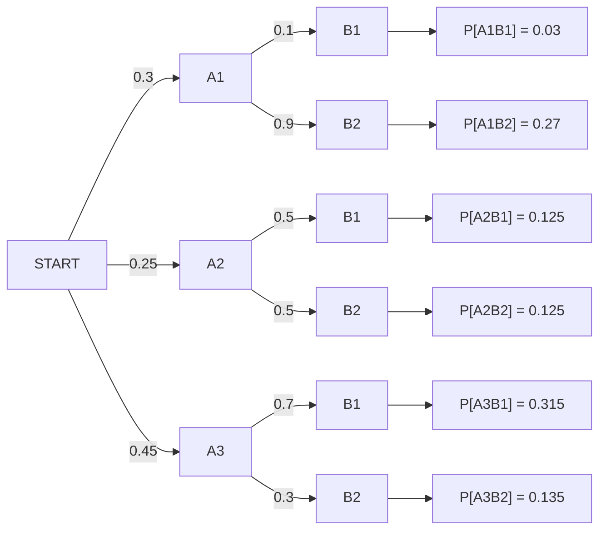

Tree diagrams are useful for modelling experiments which are followed up by a sub-experiment. The sub-experiment may be dependent of previous experiments.  

___
< [[Spring 2024/EEC161/Notes/Independence|Independence]] | Current Page | [[Spring 2024/EEC161/Notes/Counting Methods|Counting Methods]] >